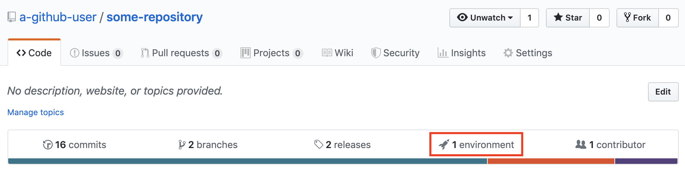
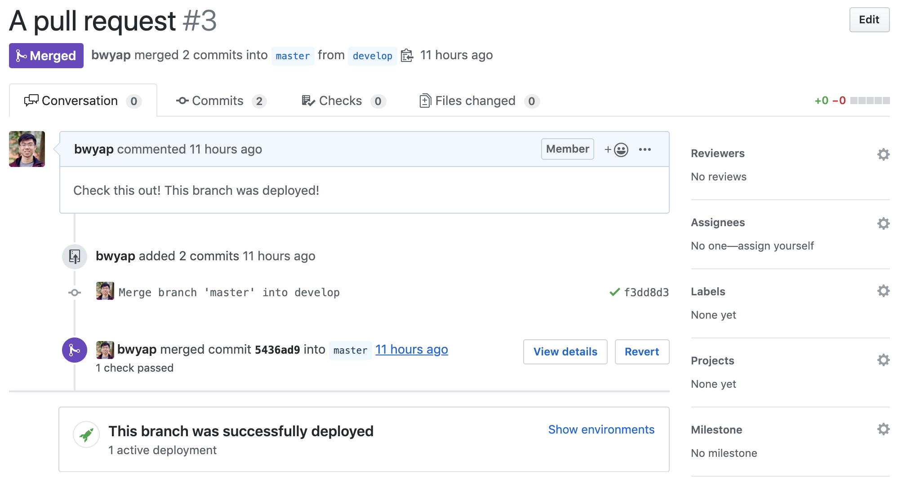
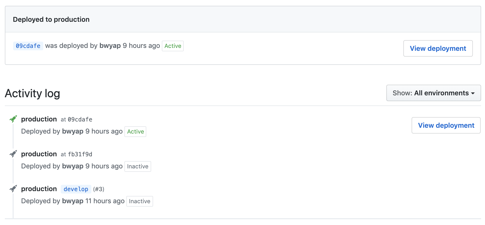

# Github deploy status

> Node.js scripts that update a Github repository's deployment status.

Did you know that you keep track of your deployments right on Github.com?
You can do this through the **Environment** tab!



_What is the **Environment** tab and why don't I see it on my repositories?_

The Environment tab only shows up if you add a **deployment**
to your Github repository. Once you've added a deployment, you can
update its status to show whether it's pending, in progress, successful,
failed, or errored. Some third-party integrations such
[Heroku](https://devcenter.heroku.com/articles/github-integration)
do this for you, so when you deploy through that service, it shows
up on your Github page. If you deploy through custom CI scripts
using services such as Travis CI, this won't show up automatically.

This package provides CLI scripts to help interface with Github's
[deployments API](https://developer.github.com/v3/repos/deployments)
so you can track your deployments right in your pull requests:



And see a history of your deployments in the **Environment** tab!



## Usage

Install this package using `yarn` or `npm`:

```bash
yarn add -D github-deploy-status
```

```bash
npm i -D github-deploy-status
```

You can now use the command right in your shell!

```bash
github-deploy-status ...
```

Just make sure you give the correct arguments. See below for the arguments required.

## Arguments

#### `--token <token>`

This argument is _required_.

Interfacing with the Github API requires authentication. Create a
[personal API token](https://github.blog/2013-05-16-personal-api-tokens/)
and provide it to the script so that it can use it to authorise your
requests. Ensure that you grant your token the `repo_deployment` scope.

#### `--action <action>` or `-a <action>`

This argument is _required_.

`<action>` must be one of the following values:

- `create`
- `fail_if_unsuccessful` \*
- `success`
- `failure`
- `error`
- `in_progress`

Using `create` action will create a new deployment.

\* The `fail_if_unsuccessful` action is special - it will first **check** the status
of the latest deployment. If it is **NOT** successful (e.g. it is pending or in
progress), it will add a new `failure` status. This is useful to call at the end
of your deployment scripts in case the deployment doesn't complete and there is
no way to receive feedback other than to check the deployment status.

There must be an existing deployment before you add deployment statuses. The
remaining actions (`success`, `failure`, `error`, `in_progress`) will add the respective statuses
to the most recent deployment.

#### `--environment <environment>` or `-e <environment>`

This argument is _required_.

Use this to provide the name of the environment you are deploying to. Common
values for this are `dev`, `staging` or `production`.

#### `--ref <ref>` or `-r <ref>`

This argument is _required_.

Provide the ref of what you want to deploy from your repository. This can be
a tag, branch, or SHA.

#### `--user <username>` or `-u <username>`

This argument is _required_.

Provide the username of the user who owns the repository that you are
managing deployments for.

#### `--repo <repo_name>` or `-p <repo_name>`

This argument is _required_.

Provide the name of the repository that you are managing deployments for.

#### `--url <url>` or `-l <url>`

This argument is _optional_.

Provide a link to the deployed environment if you want the **View deployment**
button to show up next to your active deployments.

## Example

One way to take advantage of this script is to add it to your `package.json` and `.travis.yml`:

`package.json`:

```json
{
  ...
  "scripts": {
    "install-all": "yarn",
    "build-all": "tsc",
    "gds": "github-deploy-status -u a-user -p some-repository"
  }
  ...
}

```

`.travis.yml`:

```yml
...

jobs:
  include:
    - stage: Staging
      before_deploy:
        - yarn add github-deploy-status
        - yarn gds --token $GITHUB_TOKEN -a create -e staging -r develop
        - yarn gds --token $GITHUB_TOKEN -a in_progress -e staging -r develop
      deploy:
        ...
        on:
          branch: develop
      after_deploy:
        - yarn gds --token $GITHUB_TOKEN -a success -e staging -r develop -l https://staging.myapp.com

    - stage: Production
      before_deploy:
        - yarn add github-deploy-status
        - yarn gds --token $GITHUB_TOKEN -a create -e production -r master
        - yarn gds --token $GITHUB_TOKEN -a in_progress -e production -r master
      deploy:
        ...
        on:
          branch: master
      after_deploy:
        - yarn gds --token $GITHUB_TOKEN -a success -e production -r master -l https://myapp.com
...
```

In the above example, a deployment is created when Travis starts a deployment
(whose status is set to `pending` by default), and the status is set to `success`
once the deployment completes. The user's Github access token is stored as an
environment variable on Travis CI and is access through `$GITHUB_TOKEN`.

## License

[MIT License](LICENSE)
